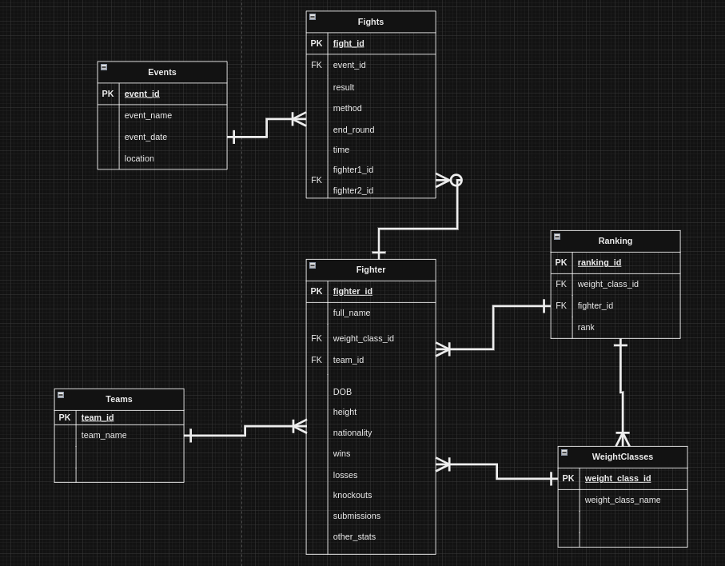

# MMA API Build with TypeORM
contains Crud and some more operations
Steps to run this project:

1. Run `npm i` command
2. Setup database settings inside `data-source.ts` file
3. Run `npm start` command

# Create Commands

CREATE TABLE Events (
    event_id SERIAL PRIMARY KEY,
    event_name VARCHAR(255) NOT NULL,
    event_date DATE,
    location VARCHAR(100)
);

CREATE TABLE Fighters (
    fighter_id SERIAL PRIMARY KEY,
    full_name VARCHAR(255) NOT NULL,
    date_of_birth DATE,
    height INT,
    nationality VARCHAR(50),
    weight_class_id INT REFERENCES WeightClasses(weight_class_id),
    team_id INT REFERENCES Teams(team_id),
    wins INT DEFAULT 0,
    losses INT DEFAULT 0,
    knockouts INT DEFAULT 0,
    submissions INT DEFAULT 0,
    other_statistics TEXT
);

CREATE TABLE WeightClasses (
    weight_class_id SERIAL PRIMARY KEY,
    weight_class_name VARCHAR(50) NOT NULL
);
CREATE TABLE Teams (
    team_id SERIAL PRIMARY KEY,
    team_name VARCHAR(100) NOT NULL
);

CREATE TABLE Fights (
    fight_id SERIAL PRIMARY KEY,
    event_id INT REFERENCES Events(event_id),
    fighter1_id INT REFERENCES Fighters(fighter_id),
    fighter2_id INT REFERENCES Fighters(fighter_id),
    result VARCHAR(50),
    method VARCHAR(50),
    end_round INT,
    time TIME
);
CREATE TABLE Rankings (
    ranking_id SERIAL PRIMARY KEY,
    weight_class_id INT REFERENCES WeightClasses(weight_class_id),
    fighter_id INT REFERENCES Fighters(fighter_id),
    rank INT
);

# ERD

